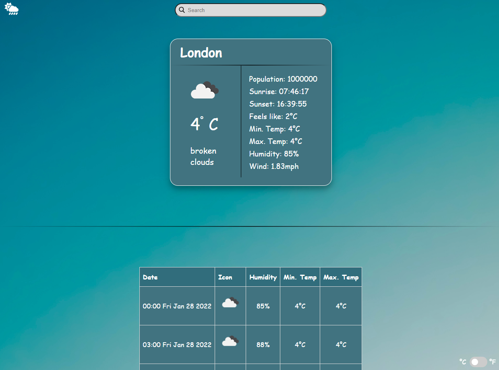

# A Weather Application
<!-- PROJECT LOGO -->
 

   

  

    <strong>Organise</strong>
     
    <a href="https://mohammad-afsari.github.io/weather_application/">View Demo</a>
    ·
    <a href="https://mohammad-afsari.github.io/weather_application/issues">Report Bug</a>
    ·
    <a href="https://mohammad-afsari.github.io/weather_application/issues">Request Feature</a>
  

<!-- ABOUT THE PROJECT -->
## About The Project

This weather application was built using the <a href="https://openweathermap.org/forecast5#5days">Open Weather</a> 5 day / 3 hour forecast data. This project focused and explored on asynchronous JavaScript and event loops as well as the usefulness in fetching data from the Open Weather server using API's.

### Built With
* HTML
* CSS
* Vanilla JavaScript
* Webpack
* Babel

## Getting Started

In order to setup and work on this project on your own, you will need to:

1. Clone this project:  
`git clone https://mohammad-afsari.github.io/weather_application.git`

2. Once you have cloned this project, you can install the required dependencies by using:  
`npm install`

3. A live demo of the project can be started by using:  
`npm start`

4. Distribution files can be produced using:  
`npm run build`

## Deployed on GitHub Pages

Deployed on [GitHub Pages](https://pages.github.com/)  

## Acknowledgement

Design inspired by [TOP](https://www.theodinproject.com/paths/full-stack-javascript/courses/javascript/lessons/weather-app)

## 🤝 Contributing

Contributions, issues, and feature requests are welcome!

## Show your support

If you got until here, show your love hitting the ⭐️ button, I'd really appreciate it.
